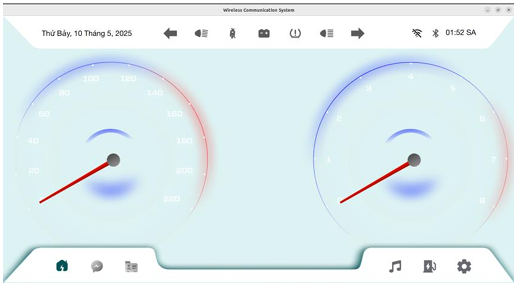

** Hệ thống HMI kết nối không dây trên xe ô tô**

🧠 Giới thiệu
Đây là dự án môn học thuộc chuyên đề Lập trình ô tô, được thực hiện bởi nhóm sinh viên Khoa Kỹ thuật Máy tính và Điện tử – Trường ĐH CNTT & Truyền thông Việt – Hàn.
Mục tiêu chính là thiết kế và triển khai một hệ thống HMI (Human-Machine Interface) cho ô tô, có khả năng kết nối không dây (WiFi, Bluetooth) để người dùng có thể giám sát và điều khiển các chức năng trong xe một cách tiện lợi và an toàn.

🌟 Chức năng nổi bật

🎛️ Giao diện người dùng (UI) trực quan và thân thiện được xây dựng bằng Qt/QML.

📡 Kết nối không dây thông qua WiFi và Bluetooth giữa các thiết bị trong xe.

📲 Tích hợp tính năng mô phỏng cuộc gọi và tin nhắn từ ESP32 lên giao diện người dùng.

⚙️ Dễ dàng mở rộng cho nhiều dòng xe và thiết bị khác nhau.

🏗️ Kiến trúc hệ thống
Phần cứng: ESP32, thiết bị đầu ra(LED).

Phần mềm:

ESP32: điều khiển các cảm biến và truyền dữ liệu qua WiFi/Bluetooth.

Ứng dụng Qt (trên PC): giao diện HMI đọc dữ liệu và mô phỏng điều khiển xe.

🛠️ Công nghệ sử dụng
Thành phần	Mô tả
ESP32	Vi điều khiển hỗ trợ WiFi + Bluetooth
Qt (C++/QML)	Thiết kế giao diện HMI
Arduino IDE	Lập trình và nạp firmware cho ESP32
Qt SerialPort	Giao tiếp với ESP32 qua UART/Bluetooth
WiFi/Bluetooth	Kết nối không dây với ứng dụng

📈 Kết quả thực nghiệm
✅ Kết nối Bluetooth ổn định ~10m, WiFi ổn định ~30m.

✅ Giao diện phản hồi tốt, độ trễ thấp (~150–500ms).

✅ Xử lý nhanh tín hiệu cuộc gọi và tin nhắn mô phỏng từ ESP32.

✅ Giao diện đẹp, dễ sử dụng với cảm ứng và thao tác rõ ràng.
